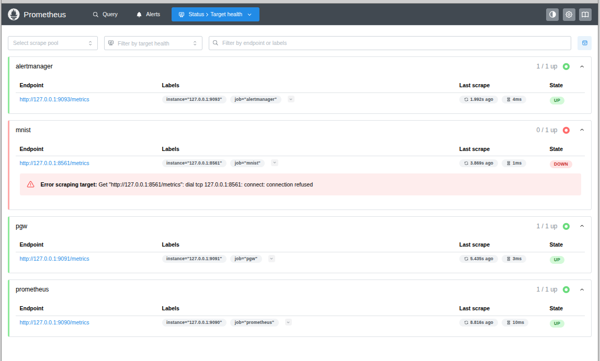

# Examples
## Prerequisites for running the Examples
You'll need
 * Python 3.10+
 * [Docker](https://www.docker.com)

You can then checkout the Gangplank source and example code

```bash
git clone https://github.com/hammingweight/gangplank.git
cd gangplank/examples 
```

## Running Prometheus and a Pushgateway (PGW) Locally
The Gangplank examples require that you run a Prometheus server bound to `127.0.0.1:9090` and a Prometheus pushgateway that is listening
on `127.0.0.1:9091`. If you've installed Docker, you can run `./start_prometheus.sh` to start a server, a gateway and,
additionally, a Prometheus alertmanager

```
$ ./start_prometheus.sh 
f8cccd7201dab455523450546629064df0a9ac590da997718de86fb3c8059cdd
1677ef1c098562999cc5160a52aab5f568256f7df6b05bb208129e7c7e25329f
977eee5dc5149d9f2cc5a757df3ded2cce393282062c4597e2b8eb8bfdd25ce3
CONTAINER ID   IMAGE               COMMAND                  CREATED          STATUS          PORTS     NAMES
977eee5dc514   prom/alertmanager   "/bin/alertmanager -…"   10 seconds ago   Up 10 seconds             alertmanager
1677ef1c0985   prom/pushgateway    "/bin/pushgateway"       11 seconds ago   Up 10 seconds             pgw
f8cccd7201da   prom/prometheus     "/bin/prometheus --c…"   11 seconds ago   Up 11 seconds             prometheus
```

Running `curl http://127.0.0.1:9090/metrics`, `curl http://127.0.0.1:9091/metrics` and `curl http://127.0.0.1:9093/metrics` should return the metrics
exposed by the server, the gateway and the alertmanager.

Looking at the [prometheus.yml](./prometheus/prometheus.yml) configuration file shows that Prometheus is configured to collect metrics from itself, the pushgateway and
the alertmanager. Opening [`http://localhost:9090/targets`](http://localhost:9090/targets) will show that those targets are up. You'll also see that Prometheus is
trying to scrape metrics from a service running on port 8561 but that the service ("mnist") is down. The "mnist" service can be started by running the
[prediction/inference](https://github.com/hammingweight/gangplank/tree/main/examples/predict) example code.




## Gangplank Metrics
Metrics stored in Prometheus have names that are (usually) in snake case and prefixed with a library name. Gangplank metrics are exposed with a `gangplank_` prefix:
 * `gangplank_train_` for training metrics
 * `gangplank_test_` for testing/evaluation metrics
 * `gangplank_predict_` for inference/prediction metrics.


## MNIST Dataset and Keras Model
The examples use a convolutional neural network (CNN) to classify handwritten digits from an MNIST dataset. The dataset consists of 70,000 black and white images, of 28 x 28 pixel resolution, where each image is of a single digit from 0 to 9.

The CNN model is from one of François Chollet's [Jupyter notebooks](https://github.com/fchollet/deep-learning-with-python-notebooks/blob/master/chapter08_intro-to-dl-for-computer-vision.ipynb)
that accompany his book ["Deep Learning with Python, second edition"]([https://www.manning.com/books/deep-learning-with-python](https://www.manning.com/books/deep-learning-with-python-second-edition)).

The inputs to the CNN are batches of tensors of shape (28, 28, 1) and the outputs from the CNN are one-hot encodings of the values 0 to 9; i.e. if an image can be categorized confidently as one of the decimal digits, then one of the CNN's ten outputs will have a value close to one while the other nine outputs will have a value close to zero.


## Usage Examples
[Training:](./train/) This sample code trains a model to identify handrwitten digits from the
MNIST dataset and exposes training metrics to Prometheus. Publishing training metrics uses Gangplank's [`TrainTestExporter](../src/gangplank/train_test_exporter.py) class that extends the `keras.callbacks.Callback` class.
This script must be run before running the other examples since it saves a Keras model to disk that is needed for the remaining examples. 

[Testing:](./test/) This example evaluates the model created by the training script and exports the metrics to Prometheus. The sample code demonstrates
some additional options when instantiating a `TrainTestExporter` object.

Both the training and testing examples use the Prometheus pushgateway.

[Prediction/Inference:](./predict/) This example uses the model created by the training script to perform inference. The example exposes the number of inference requests and the associated running time to Prometheus. Instrumenting inference does not need the pushgateway; instead Gangplank instruments a [`PrometheusModel`](../src/gangplank/prometheus_model.py) object that proxies a Keras model.

[Drift detection:](./drift/) There are two examples of detecting drift and displaying drift metrics in Prometheus. The first example uses the alibi-detect library's `MMDDriftOnline` class to detect drift. The second example uses SciPy's stats module to emit a chi-square *p*-value metric. The second example also shows off
Prometheus's alertmanager to raise an alert if drift is detected.  
