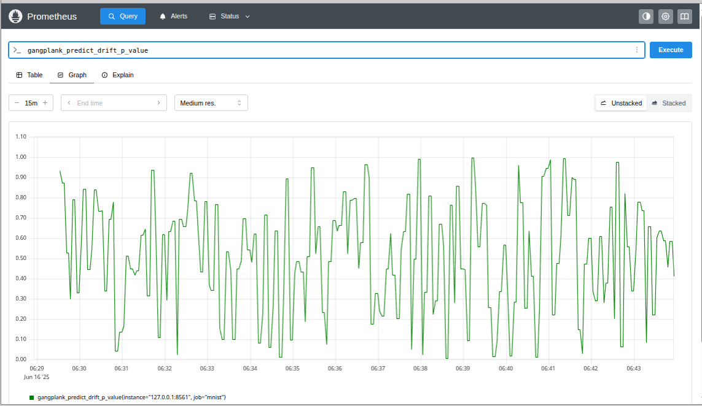
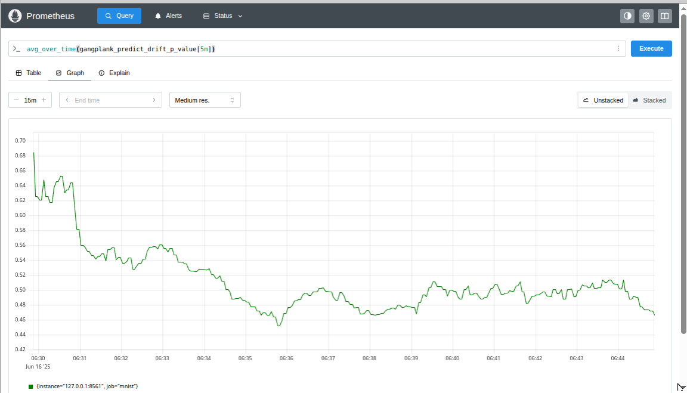
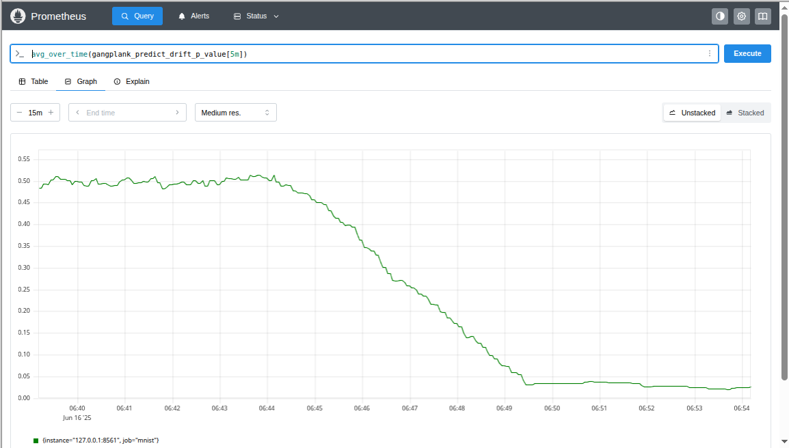
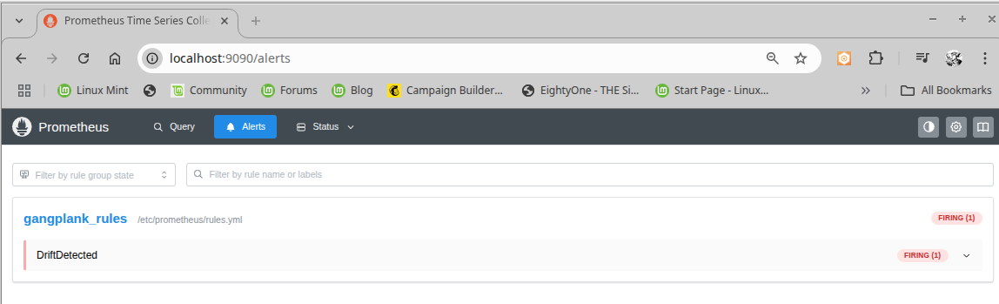

# Drift Detection using SciPy Stats
## The Chi-square Test
The MNIST dataset has 70,000 images of the digits 0 to 9 with 7,000 images of each digit. We trained a model with a
uniform distribution of the digits under the assumption that all digits are equally likely. If, in production, we
see our model predicting a non-uniform distribution, we should investigate.

The chi-square test is a popular choice for testing whether observations differ significantly from an expected
distribution. The test returns a *p*-value in the range [0, 1] where a small value (e.g. <0.05) would be suggestive
that the observed data is different from the assumed distribution. A small *p*-value would suggest that data
in production has drifted from the data that was used in training.

## A `get_drift_metrics_func` for the chi-square test
The following function is used by [drift.py](./drift.py) to return a drift metric for the predicted values.
The input data (`_X`) are not used.

```python
def get_drift_metrics(_X, Y):
    # The chi-square test isn't reliable for small samples; needing 5+
    # values per bucket is a good heuristic. Since we have 10 buckets, we'll
    # need at least 50 values in a batch.
    if len(Y) < 50:
        return gangplank.Drift()
    buckets = [0] * 10
    for y in Y:
        buckets[y.argmax()] += 1
    res = stats.chisquare(buckets)
    return gangplank.Drift(p_value=res.pvalue, test_statistic=res.statistic)
```

If there are sufficient (50 or more) predictions, the function places the predictions in buckets to obtain the distribution of the values 0 to 9
in the batch. A chi-square test can then be used to determine how closely the sampled distribution matches a uniform distribution. The function returns
the associated *p*-value and test statistic.

The `get_drift_metrics` function is passed as an argument to the `PrometheusModel` constructor

```python
# A proxy that instruments the Keras model. We use the closure to check for
# prediction drift so that we can emit drift metrics.
model = gangplank.PrometheusModel(
    model, port=8561, get_drift_metrics_func=get_drift_metrics
)
``` 

## Running the `drift.py` script
The [drift.py](./drift.py) script exercises a Keras model by submitting batches of MNIST images to the model where the batches contain between 1
and 200 images. For the first 15 minutes, the script selects images at uniformly at random.

```
$ KERAS_BACKEND=torch python drift.py 
Predictions without drift...
```

The Prometheus client running in the `drift.py` script is returning *p*-values

```
$ curl -s http://localhost:8561/metrics | grep gangplank_predict_drift_p_value
# HELP gangplank_predict_drift_p_value A p-value that quantifies the likelihood that drift has not occurred
# TYPE gangplank_predict_drift_p_value gauge
gangplank_predict_drift_p_value 0.7349861974693668
```

Viewing the *p*-values in the Prometheus dashboard shows that the values are gyrating between 0 and 1.



Using Prometheus's `avg_over_time` to get the average value over 5 minute windows leads to a smoother graph showing an average value of about 0.5.



After 15 minutes, the script artificially introduces drift by not submitting any images of the digit 0 and the average *p*-value falls from 0.5 to a little
below 0.05. A *p*-value of less than 0.05 is suggestive that the actual distribution does not match the expected distribution.



## Prometheus Alerts
Alerts can be created in Prometheus when some query returns an unexpected result. The Prometheus server has been configured with a [rule](../../prometheus/rules.yml)
to generate an alert if the average *p*-value falls below 0.05.

```yaml
rules:
  - alert: DriftDetected
    expr: avg_over_time(gangplank_predict_drift_p_value[5m]) < 0.05
```

The "Alerts" dashboard shows that the "DriftDetected" alert is firing



Alerts are managed by an alertmanager which can be configured to send pages, post on Slack, send an email, etc. when an alert fires. Opening [http://localhost:9093](http://localhost:9093) will show the same alert in the alertmanager.
