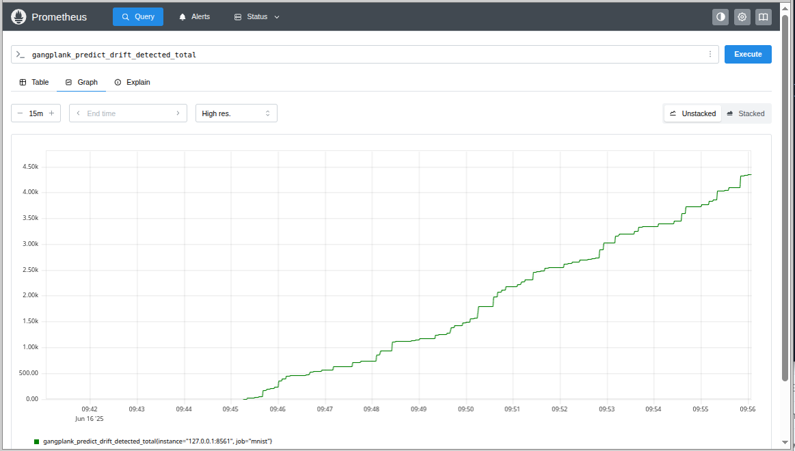
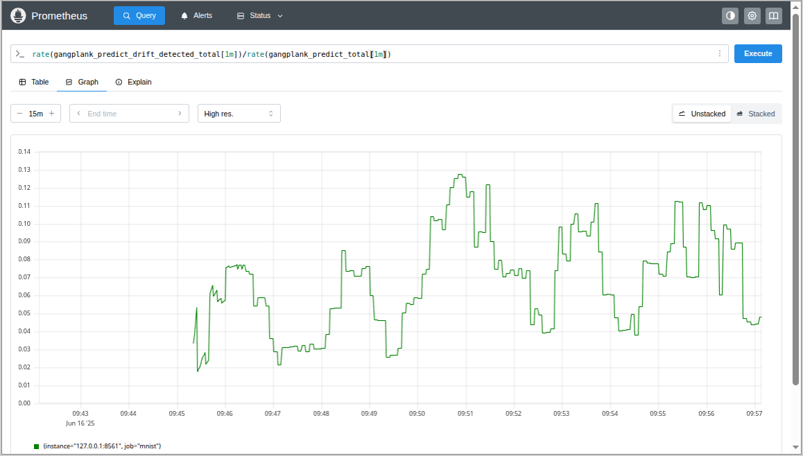
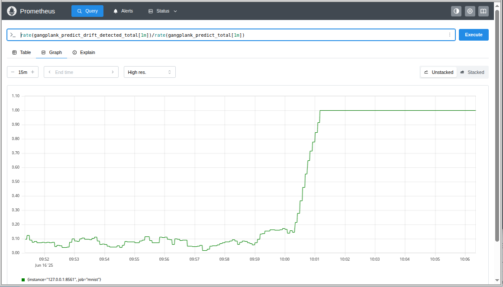
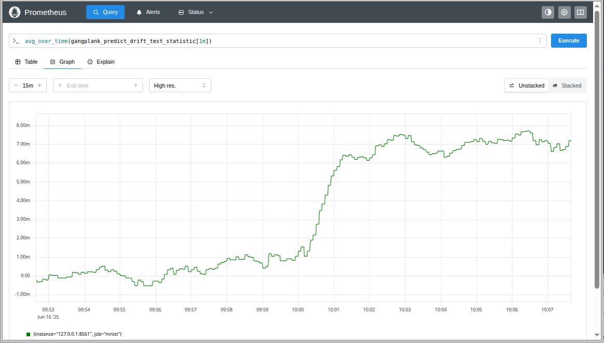

# Drift Detection using Alibi Detect
## Alibi Detect
Alibi detect is a Python library that provides drift detection tests. Alibi's tests can be classified as online (realtime)
or batch (offline). In this example, we'll use the online MDD (maximum mean discrepancy) test, `MMDDriftOnline`. 
The `alibi-detect` and `pytorch` libraries must be installed to run this drift detection code

```
$ pip install alibi-detect[torch]
```

## Configuring an `MMDDriftOnline` Drift Detector
To compare observed and expected distributions, it is necessary to determine the expected distribution. In this example, we want
to check for *prediction* drift, so we need to determine the distribution of the predictions for the training data. That's achieved
by the following lines in the [drift.py](./drift.py) script.

```
preds = model.predict(train_images[:20000], verbose=0)
drift_detector = cd.MMDDriftOnline(
    preds, ert=500, window_size=200, backend="pytorch", n_bootstraps=5000
)
```

where `preds` are the predictions for 20,000 training images from the MNIST dataset. The `window_size=200` argument is used to
specify that a rolling window of 200 predicted values must be used to detect whether drift has occurred.

**Note:** This example is artificial since we know that the expected distribution should be a uniform distribution of the values 0 to 9. `alibi-detect` provides
heavier machinery than is actually needed. The [chi-square](../chi_square) example uses more elementary statistics than is used here.


## A `get_drift_metrics_func` for the MMD Test
The `MMDDriftOnline` detector can be used to return drift metrics.

```
# A closure that uses the MMD to check whether predicted values are drifting
# from the training data. The function returns the number of times that
# the MMD reports that drift was detected in the predictions. Note
# that the input values (_X) are discarded since we're interested in
# prediction drift not data drift.
def get_drift_metrics(_X, Y):
    count = 0
    ts = None
    for y in Y:
        res = drift_detector.predict(y, return_test_stat=True)["data"]
        if res["is_drift"] == 1:
            count += 1
        if len(Y) == 1:
            ts = res["test_stat"]
    return gangplank.Drift(drift_detected=count, test_statistic=ts)
```

The `predict` method of a `MMDDriftOnline` director returns a dictionary where the `is_drift` key indicates whether drift has been detected.

The `get_drift_metrics` can be passed to the constructor of a `PrometheusModel` to export drift metrics

```
model = gangplank.PrometheusModel(
    model, port=8561, get_drift_metrics_func=get_drift_metrics
)
```

## Running the `drift.py` Script
The [drift.py](./drift.py) script demonstrates how the drift detector can identify drift. Drift is artificially introduced in the script. To run the script:

```
$ KERAS_BACKEND=torch python drift.py 
No GPU detected, fall back on CPU.
Generating permutations of kernel matrix..
100%|███████████████████████████████████████████████████████████████████████████████████████████| 5000/5000 [53:04<00:00,  1.57it/s]
Computing thresholds: 100%|███████████████████████████████████████████████████████████████████████| 200/200 [40:13<00:00, 12.07s/it]
Drift detector created. Press Enter to continue...

Predictions without drift...
```

**Constructing an `MMDDriftOnline` object can be very time-consuming. On a Ryzen 7 3700 CPU, instantiating the object for this example took more than 90 minutes (see above). Also, inference can be significantly slowed down if drift detection is done as part of the `predict` call.**

For 15 minutes the script runs without inducing any drift. However, if we plot the `gangplank_predict_drift_detected_total` we see that drift incidents are
being reported



We should expect that the MDD test will erroneously report some incidents of drift since a statistical test can report false positives. To get a better assessment of whether drift is
actually occurring, we should look at the ratio of drift incidents to the number of predictions instead of the absolute number of drift incidents. A suitable PromQL (Prometheus Query Language) 
query is `rate(gangplank_predict_drift_detected_total[1m])/rate(gangplank_predict_total[1m])`



The graph shows that about 7% of predictions are reported as "drift detected" incidents.

After 15 minutes, the script discards any images of the digit 0 and performs inference only on images of the digits 1 to 9. Under the assumption that 10% of images should be of a '0', the probability of not encountering any images of a '0' in a window of 200 predictions is very small. Unsurprisingly, the ratio of "drift detected" incidents climbs from 7% to 100% as seen below.



The `get_drift_metrics` function returns not only a count of "drift detected" incidents but also a test statistic showing the distance between samples and the
expected distribution.



The above plot shows that the value of the test statistic increases from close to 0 when there is no drift to about 0.007 when drift is induced.
