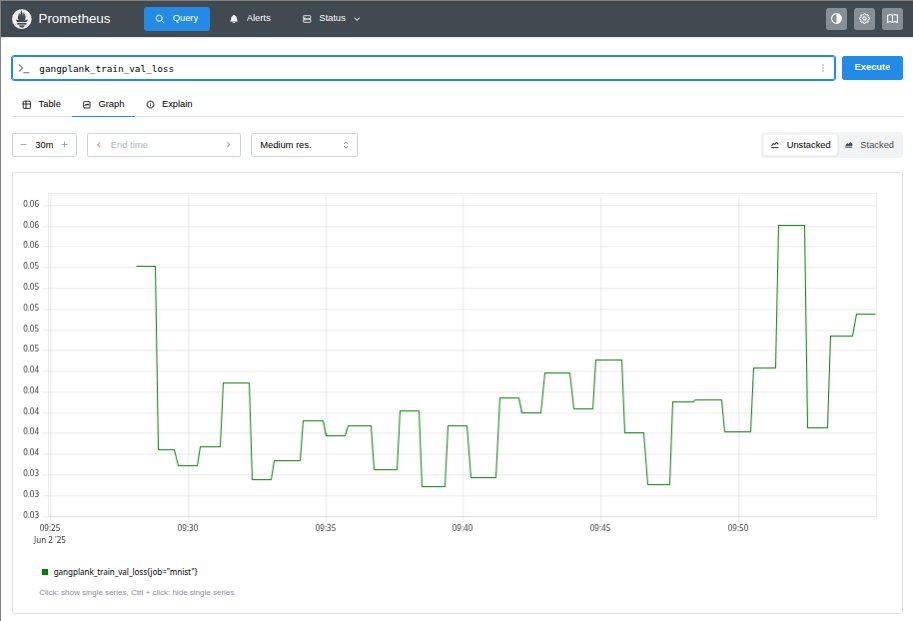

# MNIST Dataset
This example trains and evaluates a convolutional neural network to classify the handwritten digits in the MNIST database.
The model used is from one of François Chollet's [Jupyter notebooks](https://github.com/fchollet/deep-learning-with-python-notebooks/blob/master/chapter08_intro-to-dl-for-computer-vision.ipynb)
that accompany his book ["Deep Learning with Python"]([https://www.manning.com/books/deep-learning-with-python](https://www.manning.com/books/deep-learning-with-python-second-edition)).

The code in this directory instruments the model to push metrics to a Prometheus Pushgateway during training and testing.

## Training the model
The [code](https://github.com/hammingweight/gangplank/blob/main/examples/mnist/train.py) to train the model creates a 
[`gangplank.TrainTestExporter`](https://github.com/hammingweight/gangplank/blob/5bd199e195e89293678fa53fce0592fe1f3a4efd/examples/mnist/train.py#L36C5-L36C32)

```
gangplank.TrainTestExporter("127.0.0.1:9091", "mnist"),
```

that specifies the address of the Prometheus PGW and that the job name is "mnist".

You can run the training script by running `python3 train.py`. Once the first training epoch has finished, you should be able to retrieve some
metrics with the prefix `gangplank_train` from the PGW

```
$ curl -s http://localhost:9091/metrics | grep gangplank_train | grep -v '#' 
gangplank_train_accuracy{instance="",job="mnist"} 0.9448703527450562
gangplank_train_elapsed_time_seconds{instance="",job="mnist"} 53.397014141082764
gangplank_train_epochs_count{instance="",job="mnist"} 1
gangplank_train_loss{instance="",job="mnist"} 0.18397289514541626
gangplank_train_model_parameters_count{instance="",job="mnist"} 104202
gangplank_train_val_accuracy{instance="",job="mnist"} 0.9835000038146973
gangplank_train_val_loss{instance="",job="mnist"} 0.05415859818458557
```
The metrics include the training and validation loss and accuracy, the number of completed epochs, the running time and the number of weights (parameter) in the model.

The Prometheus server dashboard can be used to query or view the metrics. For example, the image shows that validation loss reached a minimum at 09:38 (epoch 13) and the training
started to overfit the data after that.




## Testing the model
The training code saves the best model to a file, "mnist_convnet.keras". The testing [code](https://github.com/hammingweight/gangplank/blob/main/examples/mnist/test.py)
loads the model and evaluates the model using the MNIST test data. The code instantiates a `TrainTestExporter`

```
callback = gangplank.TrainTestExporter(
    "http://localhost:9091",
    "mnist",
    histogram_buckets=gangplank.HISTOGRAM_WEIGHT_BUCKETS_0_3,
    ignore_exceptions=False,
)
```
to:
 * Emit a histogram of model weights in buckets in the interval [-0.3, 0.3]
 * Abort the test run if an exception occurs (e.g. if the PGW is down)

To test the model, run `python test.py`.

The test/evaluation metrics are emitted with a `gangplank_test` prefix

```
$ curl -s http://localhost:9091/metrics | grep -v '#' | grep gangplank_test
gangplank_test_accuracy{instance="",job="mnist"} 0.9896000027656555
gangplank_test_elapsed_time_seconds{instance="",job="mnist"} 2.2292304039001465
gangplank_test_loss{instance="",job="mnist"} 0.041046421974897385
gangplank_test_model_parameters_count{instance="",job="mnist"} 104202
gangplank_test_model_weights_bucket{instance="",job="mnist",le="-0.3"} 1122
gangplank_test_model_weights_bucket{instance="",job="mnist",le="-0.25"} 2456
gangplank_test_model_weights_bucket{instance="",job="mnist",le="-0.2"} 5280
gangplank_test_model_weights_bucket{instance="",job="mnist",le="-0.15"} 10759
gangplank_test_model_weights_bucket{instance="",job="mnist",le="-0.1"} 20734
gangplank_test_model_weights_bucket{instance="",job="mnist",le="-0.05"} 36836
gangplank_test_model_weights_bucket{instance="",job="mnist",le="0"} 58190
gangplank_test_model_weights_bucket{instance="",job="mnist",le="0.05"} 77984
gangplank_test_model_weights_bucket{instance="",job="mnist",le="0.1"} 91480
gangplank_test_model_weights_bucket{instance="",job="mnist",le="0.15"} 99129
gangplank_test_model_weights_bucket{instance="",job="mnist",le="0.2"} 102498
gangplank_test_model_weights_bucket{instance="",job="mnist",le="0.25"} 103643
gangplank_test_model_weights_bucket{instance="",job="mnist",le="0.3"} 104013
gangplank_test_model_weights_bucket{instance="",job="mnist",le="+Inf"} 104202
gangplank_test_model_weights_sum{instance="",job="mnist"} 0
gangplank_test_model_weights_count{instance="",job="mnist"} 104202
gangplank_test_model_weights_created{instance="",job="mnist"} 1.7488593562987614e+09
```

Some information that can be gleaned from the metrics is that:
 * It took 2.23 seconds to evaluate the 10000 test samples
 * The model accuracy is 98.96%
 * There are 104202 model weights
 * 1122 model weights have a value less than -0.3
