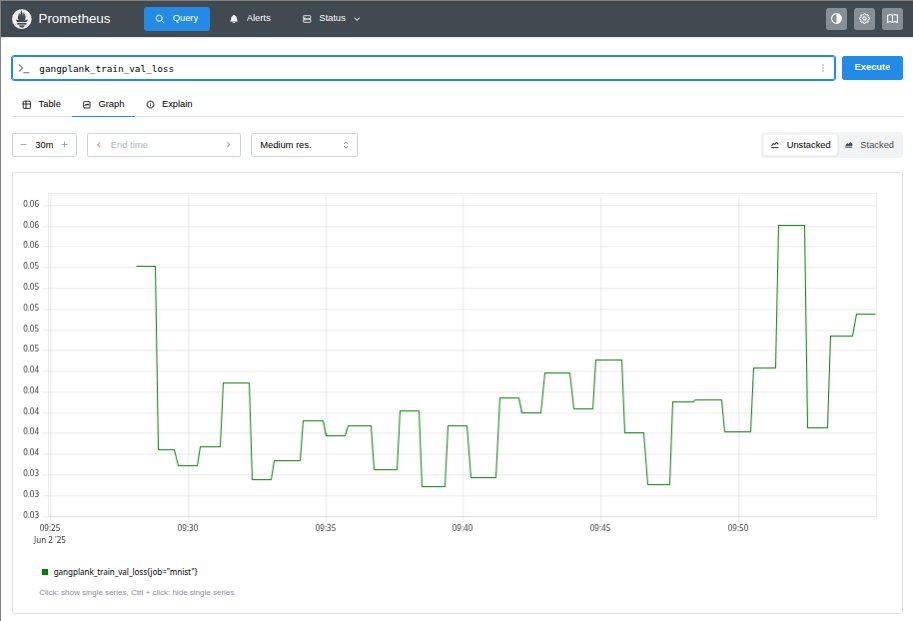

# Training a Model
## Gangplank and the Prometheus Pushgateway
Monitoring systems can be push- or pull-based. Prometheus is pull-based: it pulls metrics from services or infrastructure at configured intervals. A disadvantage of pull-based monitoring is that batch jobs and other ephemeral processes are not well-suited to having
metrics pulled. The Prometheus pushgateway was created to work around this limitation. Instead of polling ephemeral processes, those processes push metrics to the pushgateway and Prometheus scrapes the metrics from the gateway.

Machine learning training and testing jobs are ephemeral and, so, the idiomatic way to store training metrics in
Prometheus is for Gangplank to push the metrics (like loss, accuracy or mean absolute error) to the gateway.

## The Gangplank `TrainTestExporter` Class
A `TrainTestExporter` object pushes training and testing metrics to a pushgateway. The class's constructor
takes two mandatory arguments and four optional arguments:
 * `pgw_addr` is the address of the pushgateway (e.g. 127.0.0.1:9091).
 * `job` is a name to attach to the metrics.
 * `metrics` is an optional argument to specify which metrics to emit. If omitted, all available metrics are exported.
 * `histogram_buckets` is an optional list of `float`s to specify the buckets that the model's weights will be placed into (e.g. `[-0.3, -0.1, 0.1, 0.3]`). As a convenience, the constants
   `HISTOGRAM_WEIGHT_BUCKETS_1_0` and `HISTOGRAM_WEIGHT_BUCKETS_0_3` provide sensible choices for model weights in the intervals [-1.0, +1.0] and [-0.3, +0.3].
 * `handler` is an optional callback function that must be supplied if the pushgateway requires authentication; see [https://prometheus.github.io/client_python/exporting/pushgateway/](https://prometheus.github.io/client_python/exporting/pushgateway/)
 *  if the optional `ignore_exceptions` argument is `False`, the training or testing run will be aborted if the metrics can't be processed or pushed (e.g. the gateway is down).

An example instantiation of a `TrainTestExporter` would be

```python
callback = gangplank.TrainTestExporter("127.0.0.1:9091", "mnist", histogram_buckets=gangplank.HISTOGRAM_WEIGHT_BUCKETS_0_3)
```

## The Training Script
The [training script](./train.py) instantiates a `gangplank.TrainTestExporter` callback

```python
gangplank.TrainTestExporter("127.0.0.1:9091", "mnist"),
```

that specifies the address of the Prometheus PGW and that the job name is "mnist".

The training script also creates a `ModelCheckpoint` callback to save the model whenever validation loss improves

```python
callbacks = [
    keras.callbacks.ModelCheckpoint(
        filepath="../models/mnist_convnet.keras",
        save_best_only=True,
        monitor="val_loss",
    ),
    gangplank.TrainTestExporter("127.0.0.1:9091", "mnist"),
]
```

The `TrainTestExporter` and `ModelCheckpoint` callbacks are passed as arguments to the model's `fit` method

```python
model.fit(
    train_images,
    train_labels,
    epochs=30,
    validation_split=validation_split,
    batch_size=64,
    callbacks=callbacks,
)
```

## Running the Training Script
You can run the training script by running `python train.py`. Once the first training epoch has finished, you can retrieve
metrics with the prefix `gangplank_train` from the PGW

```
$ curl -s http://localhost:9091/metrics | grep gangplank_train | grep -v '#' 
gangplank_train_accuracy{instance="",job="mnist"} 0.9451481699943542
gangplank_train_elapsed_time_seconds{instance="",job="mnist"} 35.109450817108154
gangplank_train_epochs_count{instance="",job="mnist"} 1
gangplank_train_loss{instance="",job="mnist"} 0.1816869080066681
gangplank_train_model_parameters_count{instance="",job="mnist"} 104202
gangplank_train_val_accuracy{instance="",job="mnist"} 0.984333336353302
gangplank_train_val_loss{instance="",job="mnist"} 0.05358922854065895
```
The metrics include the training and validation loss and accuracy, the number of completed epochs, the running time and the number of weights (parameters) in the model.

The Prometheus server dashboard at [http://localhost:9090](http://localhost:9090/query) can be used to query or view the metrics. For example, the image shows that validation loss (`gangplank_train_val_loss`) reached a minimum at 11:04 (epoch 7) and the training
then started to overfit the data.



## Custom Metrics
Keras has a number of [metrics](https://keras.io/api/metrics/) that can be exported to Prometheus but you can also export any other measurements
that you want. The [train_with_custom_metric](./train_with_custom_metric.py) script pushes the optimizer's learning rate to Prometheus at the end
of each training epoch.

If you run `python train_with_custom_metric.py` and wait for the first training epoch to complete,
you can then get the learning rate metric from the pushgateway

```
$ curl -s http://localhost:9091/metrics | grep gangplank_train_learning_rate
# HELP gangplank_train_learning_rate learning_rate
# TYPE gangplank_train_learning_rate gauge
gangplank_train_learning_rate{instance="",job="mnist"} 0.004999999888241291
```

The learning rate metric can also be seen in the [Prometheus QueryExplorer](http://localhost:9090/query?g0.expr=gangplank_train_learning_rate&g0.show_tree=0&g0.tab=table&g0.range_input=1h&g0.res_type=auto&g0.res_density=medium&g0.display_mode=lines&g0.show_exemplars=0)
